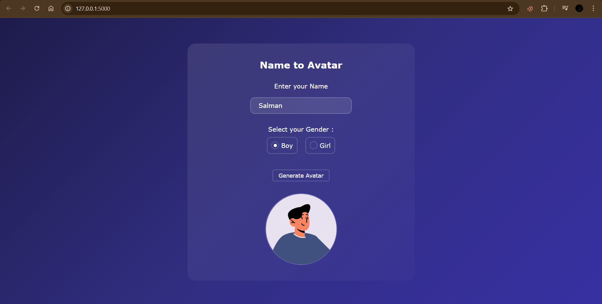

# 🎨 Name Avatar - Flask Based Avatar Generator

A simple and elegant **Flask web application** that generates personalized avatars based on user names and gender selection.

## 🌟 Features

- Generate unique avatars based on user input
- Gender-specific avatar generation
- Clean and modern UI with a dark theme
- Responsive design
- Real-time avatar preview using Flask backend

## 🛠️ Technologies Used

- Flask (Python)
- HTML5
- CSS3
- JavaScript
- [Avatar API](https://avatar.iran.liara.run/)

---

## 📂 Project Structure
```text
my_flask_app/
│
├── app/
│   ├── static/           # CSS and JS files
│   └── templates/        # HTML files
│       └── index.html
│
├── .gitignore
├── main.py               # Flask entry point
└── requirements.txt      # Python dependencies
```
---

## 🚀 How to Run Locally

1. Clone the repository:
```bash
git clone https://github.com/M-Salman-khan/name-avatar.git
```

2. Navigate to the project directory:
```bash
cd name-avatar
```

3. (Optional) Create a virtual environment:
```bash
python -m venv venv
source venv/bin/activate   # On Windows: venv\Scripts\activate
```

4. Install dependencies:
```bash
pip install flask
```

5. Run the Flask application:
```bash
python main.py
```

6. Open your browser and go to:
```
http://127.0.0.1:5000
```

---

## 💻 How to Use

1. Enter your name in the input field.
2. Select your gender (Boy/Girl).
3. Click the "Generate Avatar" button.
4. Your personalized avatar will appear below.

---

## 📸 Demo

Here's a preview of the application:



---

## 🎨 UI Features

- Modern gradient background
- Glassmorphism design elements
- Smooth animations and transitions
- Responsive layout for all screen sizes
- User-friendly interface

---

## 🤝 Contributing

Contributions, issues, and feature requests are welcome! Feel free to check the [issues page](https://github.com/M-Salman-khan/name-avatar/issues).

---

## 📝 License

This project is open source and available under the [MIT License](LICENSE).

---

## 👨‍💻 Author

**M Salman Khan**  
- GitHub: [@M-Salman-khan](https://github.com/M-Salman-khan)
